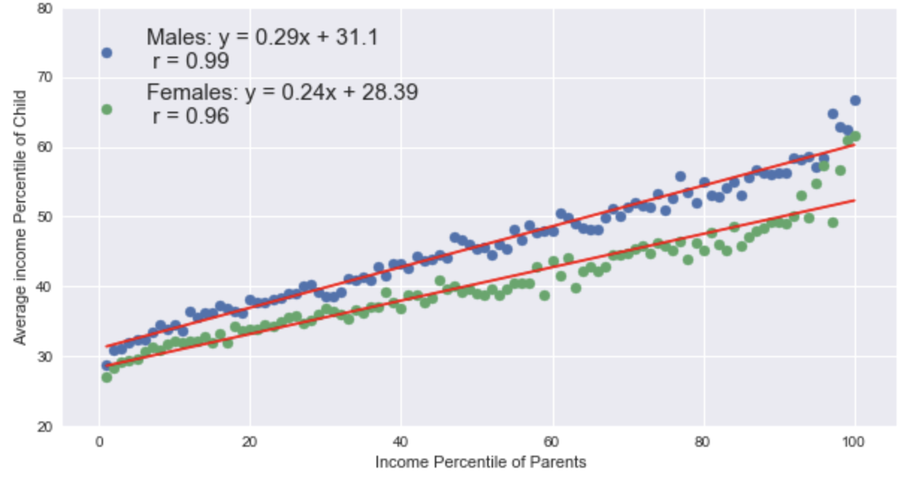
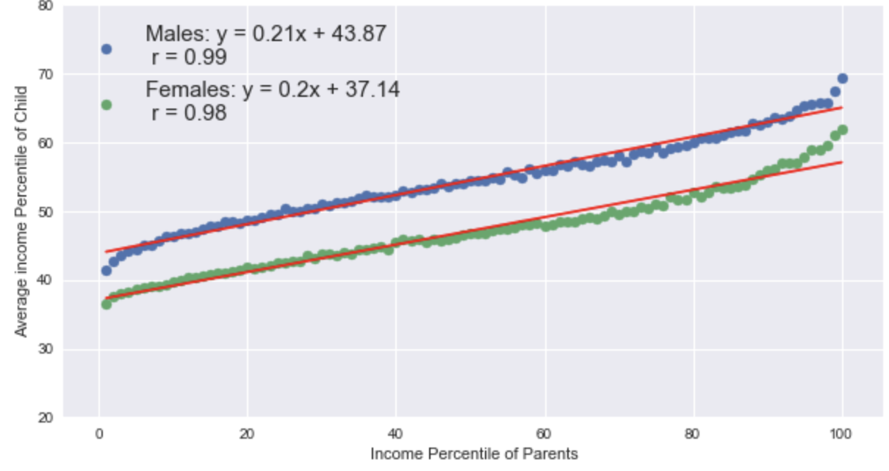

# Economic Opportunity Census Data Analysis
## Economic opportunity by Race
To understand economic mobility between racial groups in the United States I compared average income percentile of children, given the income percentile of their parents. For example, a child experiences upward economic mobility if their income percentile is greater than their parent's income percentile.  Data was aggregated amongst gender and race:

### AIAN (American Indian and Alaska Native Resources) Children

### White Children

### Black Children

### Hispanic Children

### Asian Children

### Insights
I fit linear regressions for each gender. I then calculated the integral of each line to get an understanding of the amount of economic mobility within a race and gender.  Asian males experienced the most economic mobility where AIAN females experienced the least economic mobility.  Black children was the only racial group where males experienced less economic mobility than females. 

## Economic opportunity by Location 
To understand how economic opportunity varies by location, I analyzed the average income percentile of children whose parents were in the 25th percentile, among children who grew up in a particular Census tract. I mapped census tracts to commuting zones and plotted the top and bottom five. A commuting zone is a geographic area used in population and economic analysis. There are many census tracts per commuting zone.  I calculated the commuting zone average economic mobility using a weighted average of the average economic mobility of each census tract within the commuting zone.

### Top and Bottom Five Economic Mobility Commuting Zones

### Insights
All of the top and bottom five commuting zones in the economic mobility measures are quite small compared to the national median. The national median of pooled child population is 27,043 where the top five zones’ median is 666 children and the bottom five zones’ median is 3,416 children.  I observed the most dramatic differences in economic mobility occurred in small communities. This makes sense because small samples sizes are more sensitive.

The top five commuting zones in economic mobility are predominantly white communities. White children are on average 94% of the children born and black children are on average 2% of the children born in these communities.  94% is greater than the white child national average of 73%.  2% is much less than the black child national average of 11%. I searched the top five community zones on https://censusreporter.org and found that 4 of the 5 zones were small towns in North Dakota.  The dramatic increase in economic opportunity could be due to the North Dakota oil boom that occurred in the mid to late 2000s. 

The bottom five commuting zones in economic mobility are neither predominantly white or black.  White children are on average 11% of the child population and black children are on average 2% of the child population in the bottom five commuting zones. Both average population percentages are much lower than the corresponding national averages.  I was able to find 4 of 5 zones on https://censusreporter.org.  All four zones’ populations were predominantly Native.  This is in line with the scatter plots from above where AIAN children had some of the lowest economic mobility measures. 

### Footnote
The data and inspiration for this project came from https://opportunityinsights.org
